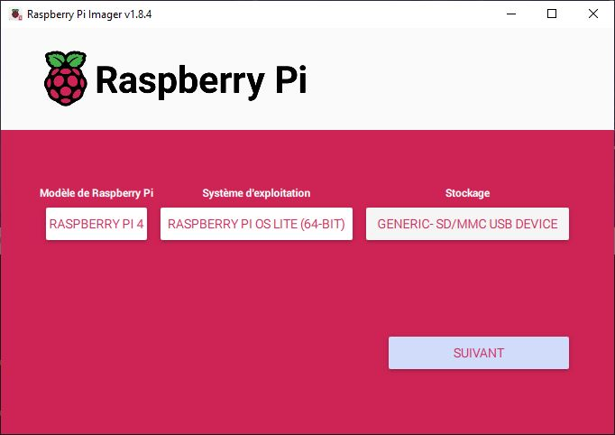
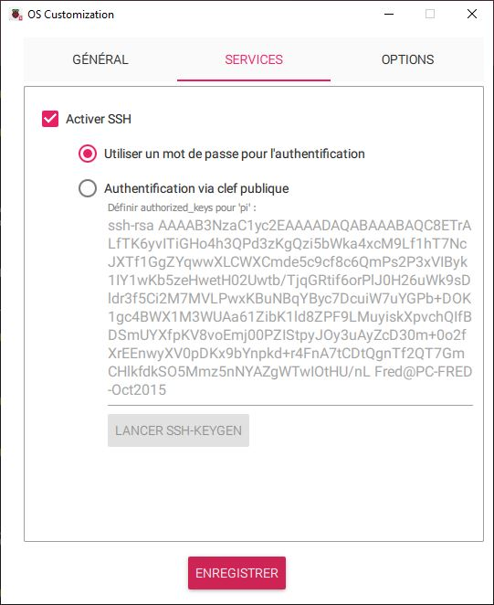
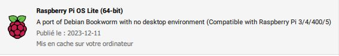

# Le Projet "ROBOT MINION" ... la programmation !!!

***Introduction***

Instructions d'installation du programme

    --> Cet article est en mode DRAFT pour le moment <--

*TODO :*
- Installation de l'OS sur la carte Raspberry PI
- Configuration
- Installation des dépendances
- le programme principale

---
## Carte SD & Système

#### Formatage de carte SD

On part de zéro, Formattage de la carte SD --> https://www.sdcard.org/downloads/formatter/

#### Installation de l'OS

Préparation de la carte SD, sous windows, à l'aide de **Raspberry Pi Imager** --> https://www.raspberrypi.com/software/

dans Raspberry Pi Imager, on sélectionne :
- le type de carte : PI 4
- l'OS  --> Raspberry PI OS (other) -->  Raspberry PI OS Lite (64-bit) **
- la carte SD cible
- dans les options de configuration : Nom machine, user/pass, conf WiFi, SSH ...

|  |  |  |
|-----|-----|-----|

** la **version Lite** permet de bénéficier d'une version sans l'environnement graphique de seulement 400Mo, tout est fait en CLI via SSH.

Pour info : version PI OS Lite (64-bits) utilisée : 2023-12-11

---

#### Connection et configuration

⚠️ il faut trouver l'adresse IP de la Raspberry PI ⚠️

    $ ssh
    pi@rpi-minion's password:

mise à jour système

    pi@rpi-minion:~ $ sudo apt update    
    pi@rpi-minion:~ $ sudo apt upgrade -y

installation des packages système indispensables

    pi@rpi-minion:~ $ sudo apt install vim git python3-pip virtualenv mpg321

Activation du service de gestion des GPIOs

    pi@rpi-minion:~ $ sudo systemctl enable pigpiod
    pi@rpi-minion:~ $ sudo systemctl start pigpiod
    pi@rpi-minion:~ $ sudo systemctl status pigpiod

#### Dépôt GIT

Récupération du dépot Git , depuis le répertoire /home/pi :

    git clone https://github.com/FredJ21/Robot_Minion_Dev.git  MINION

    Cloning into 'MINION'...
    remote: Enumerating objects: 38, done.
    remote: Counting objects: 100% (38/38), done.
    remote: Compressing objects: 100% (31/31), done.
    remote: Total 38 (delta 7), reused 32 (delta 5), pack-reused 0
    Receiving objects: 100% (38/38), 1.30 MiB | 5.25 MiB/s, done.
    Resolving deltas: 100% (7/7), done.

Création de l'environnement virtuel Python et installation des packages

    cd MINION
    virtualenv venv
    source venv/bin/activate
    pip install -r requirements.txt

    chmod +x bin/minion.py
    chmod +x bin/play_sequence.py
    cp bin/data.json.example bin/data.json

#### Premiers Tests

On peut maintenant lancer 2 terminaux  :

***pour lancer le programme principale***

    ssh pi@rpi-minion

    pi@rpi-minion:~ $ MINION/bin/minion.py

- fichier de configuration des moteurs : **bin/data.json**
- le programme ouvre un socket **UDP** sur le **port 2100** pour recevoir les commandes

***pour lancer des séquences de commandes de test***

    ssh pi@rpi-minion

    pi@rpi-minion:~ $ MINION/bin/play_sequence.py seq1

- ce programme lit les séquences (seq1, seq2, ... ) dans le rep bin
- ce programme transmet les commandes ver le port UDP:2100

---

#### Serveur WEB de commande

Installation du serveur "NodeJs" et du gestionnaire de paquets "npm"

    sudo apt install -y nodejs npm
    cd ~/MINION/web/
    npm install

pour démarrer le serveur :

    node server.js

puis pour tester :     

    http://rpi-minion:3000
    ou
    http://192.168.1.xx:3000

# TODO

---

#### Démarrage Auto des services

# TODO

  ---
