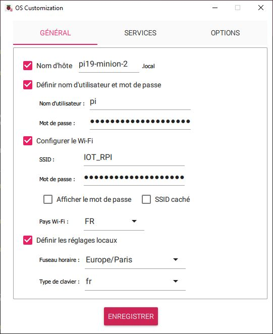

# Le Projet "ROBOT MINION" ... la programmation !!!

***Introduction***

Instructions d'installation du programme

    --> Cet article est en mode DRAFT pour le moment <--

*TODO :*
- Installation de l'OS sur la carte Raspberry PI
- Configuration
- Installation des dépendances
- Le programme principale sur github
- Premiers tests
- Le serveur Web
- La camera
- Démarrage Auto des services
- Option : Module USB WiFi
- Option : Configuration WiFi et IP

---
## Carte SD & Système

#### Formatage de carte SD

On part de zéro, Formatage de la carte SD --> https://www.sdcard.org/downloads/formatter/

#### Installation de l'OS

Préparation de la carte SD, sous windows, à l'aide de **Raspberry Pi Imager** --> https://www.raspberrypi.com/software/

dans Raspberry Pi Imager, on sélectionne :
- le type de carte : PI 4
- l'OS  --> Raspberry PI OS (other) -->  Raspberry PI OS Lite (64-bit) **
- la carte SD cible
- dans les options de configuration : Nom machine, user/pass, conf WiFi, SSH ...

|  |  |  |
|-----|-----|-----|

** la **version Lite** permet de bénéficier d'une version sans l'environnement graphique de seulement 400Mo, tout est fait en CLI via SSH.

Pour info : version utilisée : PI OS Lite **Debian Bookworm** (64-bits) pour PI3/4/400/5 Publié le 2023-12-11 ( 0.4Go )

---

#### Connection et configuration

⚠️ il faut trouver l'adresse IP de la Raspberry PI ⚠️

    $ ssh
    pi@rpi-minion's password:

mise à jour système

    sudo apt update    
    sudo apt upgrade -y

installation des packages système indispensables

    sudo apt install vim git python3-pip virtualenv mpg321 pigpiod nodejs npm python3-picamera2

Activation du service de gestion des GPIOs

    sudo systemctl enable pigpiod
    sudo systemctl start pigpiod
    sudo systemctl status pigpiod

---

#### Dépôt GIT

Récupération du dépot Git , depuis le répertoire /home/pi :

    git clone https://github.com/FredJ21/Robot_Minion_Dev.git  MINION

...

    Cloning into 'MINION'...
    remote: Enumerating objects: 38, done.
    remote: Counting objects: 100% (38/38), done.
    remote: Compressing objects: 100% (31/31), done.
    remote: Total 38 (delta 7), reused 32 (delta 5), pack-reused 0
    Receiving objects: 100% (38/38), 1.30 MiB | 5.25 MiB/s, done.
    Resolving deltas: 100% (7/7), done.

Création de l'environnement virtuel Python et installation des packages

    cd MINION
    virtualenv --system-site-packages venv
    source venv/bin/activate
    pip install -r requirements.txt

    cp bin/data.json.example bin/data.json

---

#### Premiers Tests

On peut maintenant lancer 2 terminaux  :

***pour lancer le programme principale***

    ssh pi@rpi-minion

    MINION/bin/minion.py

- fichier de configuration des moteurs : **bin/data.json**
- le programme ouvre un socket **UDP** sur le **port 2100** pour recevoir les commandes

***pour lancer des séquences de commandes de test***

    ssh pi@rpi-minion

    MINION/bin/play_sequence.py seq1

- ce programme lit les séquences (seq1, seq2, ... ) dans le rep bin
- ce programme transmet les commandes ver le port UDP:2100

***volume sonore***

Le volume sonnore peut être ajuster en CLI/SSH à l'aide des utilitaires :

- alsamixer
- amixer

---

#### Serveur WEB de commande
Installation du serveur "NodeJs" et du gestionnaire de paquets "npm"

si pas déjà fait plus haut :

    sudo apt install -y nodejs npm

Installation des dépendances :

    cd ~/MINION/web/
    npm install

pour démarrer le serveur :

    node server.js

puis pour tester :     

    http://rpi-minion:3000
    ou
    http://192.168.1.xx:3000

---

#### Caméra

Dans les nouvelles versions PI OS , la camera est gérée à l'aides des librairies/applications : picamera2, libcamera & rpicam-apps.
En détail ici :

- https://www.raspberrypi.com/documentation/computers/camera_software.html
- https://github.com/raspberrypi/picamera2
- https://datasheets.raspberrypi.com/camera/picamera2-manual.pdf

Il est nécessaire de supprimer et re créer l'environnement virtuel Python, si il n'a pas été créé avec l'option **--system-site-packages** ( plus haut )

Ref [BUG] : https://github.com/raspberrypi/picamera2/issues/341

    cd ~/MINION/
    rm -fr venv
    virtualenv --system-site-packages venv
    pip install -r requirements.txt

et si pas déjà fait plus haut :

    sudo apt install -y python3-picamera2

en suite dans le répertoire **camera** ,

2 programmes permettent de tester la caméra dans un environnement Linux avec le bureau :

- test_camera_simple.py
- test_camera_simple_mediapipe.py

2 autres programmes permettent transmettre le flux vidéo sur une page web distante

- test_camera_to_webpage.py
- test_camera_to_webpage_mediapipe.py

Enfin le script principalement permet de réaliser le tracking et de transmettre au minion :

- camera_to_minion.py

donc :

    ssh pi@rpi-minion
    MINION/camera/camera_to_minion.py

---

#### Démarrage Auto des services

Afin de démmarrer automatiquement l'ensemble des services, quelques scripts bash sont disponibles pour :

- installer les services ( en démarrage auto   
- arréter / démarrer les services
- vérifier les services

donc :

    ssh pi@rpi-minion
    cd MINION/linux_services
    ./install_service_minion.sh

puis, pour vérifier :

    ./check.sh

    ● minion_core.service - Minion Core
     Loaded: loaded (/etc/systemd/system/minion_core.service; enabled; preset: enabled)
     Active: active (running) since ...

    ● minion_web.service - Minion Web
     Loaded: loaded (/etc/systemd/system/minion_web.service; enabled; preset: enabled)
     Active: active (running) since ...

    ● minion_cam.service - Minion Camera
     Loaded: loaded (/etc/systemd/system/minion_cam.service; enabled; preset: enabled)
     Active: active (running) since ...

---

#### Option : Module USB WiFi

Afin d'améliorer et de fiabiliser la performance du réseau WiFi, j'ai ajouté à la carte Raspberry, un module USB alfa  AWUS036ACS

Ce module nécessite la compilation et l'installation de son drivers

donc, dans /home/pi :

    sudo -s

    # installation des dépendances de compilation
    apt install raspberrypi-kernel-headers dkms -y

    # récupération du drivers
    git clone https://github.com/aircrack-ng/rtl8812au
    cd rtl8812au

    # préparation pour la version 64bits
    sed -i 's/CONFIG_PLATFORM_I386_PC = y/CONFIG_PLATFORM_I386_PC = n/g' Makefile
    sed -i 's/CONFIG_PLATFORM_ARM64_RPI = n/CONFIG_PLATFORM_ARM64_RPI = y/g' Makefile

    export ARCH=arm64
    sed -i 's/^MAKE="/MAKE="ARCH=arm64\ /' dkms.conf

    # compilation et installation
    make dkms_install

    # vérification
    dkms status

Nous avons donc maintenant 2 interfaces WiFi

- wlan0 --> la carte interne de la Raspberry PI
- wlan1 --> le module USB Alfa

      ifconfig -a

        wlan0: flags=4163<UP,BROADCAST,RUNNING,MULTICAST>  mtu 1500
            inet 10.1.23.19  netmask 255.255.255.0  broadcast 10.1.23.255
            inet6 fe80::dde1:e981:c71f:2aff  prefixlen 64  scopeid 0x20<link>
            ether d8:3a:dd:18:97:04  txqueuelen 1000  (Ethernet)
            RX packets 154  bytes 13757 (13.4 KiB)
            RX errors 0  dropped 0  overruns 0  frame 0
            TX packets 154  bytes 20583 (20.1 KiB)
            TX errors 0  dropped 0 overruns 0  carrier 0  collisions 0

        wlan1: flags=4099<UP,BROADCAST,MULTICAST>  mtu 2312
              ether 00:c0:ca:b3:67:0d  txqueuelen 1000  (Ethernet)
              RX packets 0  bytes 0 (0.0 B)
              RX errors 0  dropped 0  overruns 0  frame 0
              TX packets 0  bytes 0 (0.0 B)
              TX errors 0  dropped 0 overruns 0  carrier 0  collisions 0

Il est possible de désactiver la carte WiFi interne afin de ne conserver que le module USB :

    # dans  /boot/config.txt
    # ajout de :

        dtoverlay=pi3-disable-bt
        dtoverlay=pi3-disable-wifi

    systemctl stop bluetooth
    systemctl disable bluetooth

    reboot

--> la carte Alfa passe en wlan0

#### Option : Configuration WiFi et IP

Il est également possible de modifier la configuration WiFi et IP par défaut :

  Dans :
  /etc/NetworkManager/system-connections/preconfigured.nmconnection

    [ipv4]
       method=manual
       addresses1=10.1.23.19/24,10.1.23.1
       dns=8.8.8.8;

    sudo systemctl restart NetworkManager

  ---
